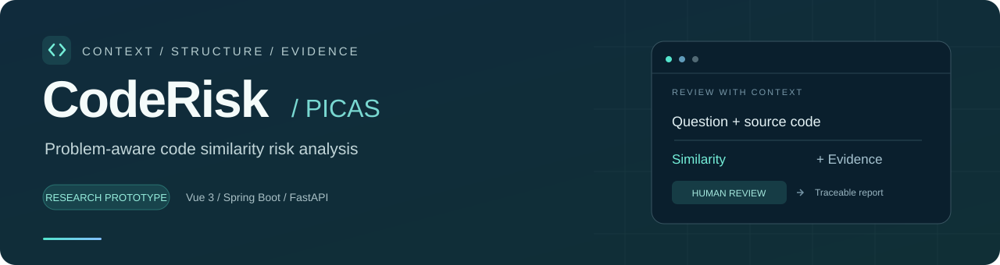
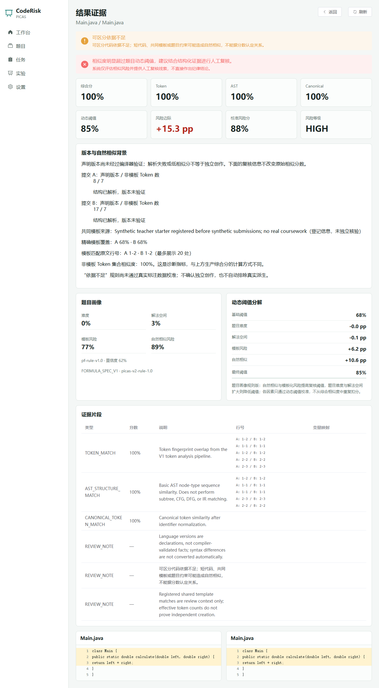
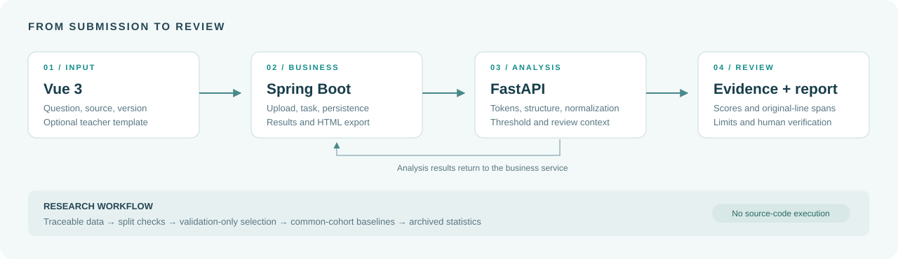
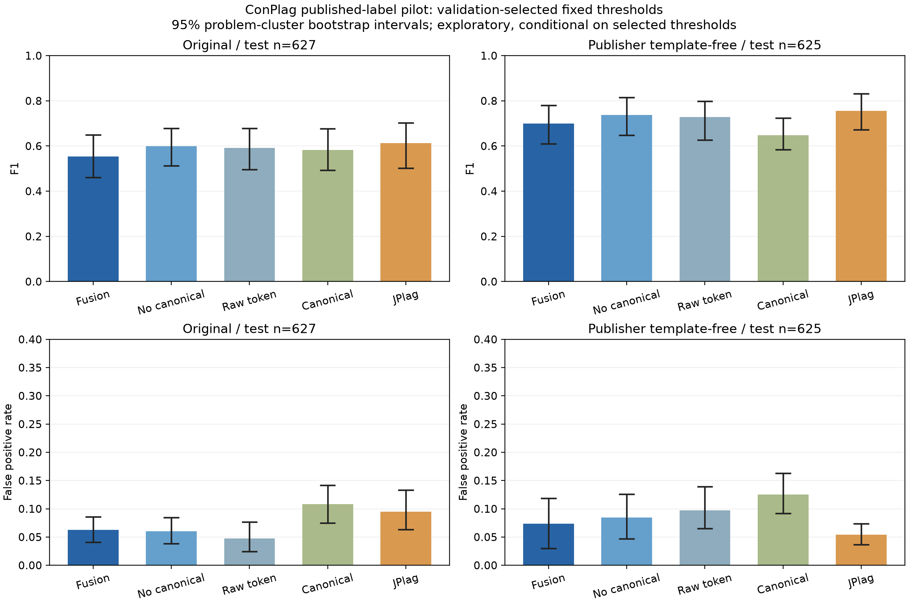

<p align="center">
  
</p>

<h1 align="center">CodeRisk / PICAS</h1>

<p align="center"><strong>面向编程作业的题目感知型代码相似风险检测系统</strong><br>
Problem-aware code similarity risk analysis for programming assignments.</p>

<p align="center">
  <a href="#快速启动">快速启动</a> ·
  <a href="#界面预览">界面预览</a> ·
  <a href="#实验与数据">实验与数据</a> ·
  <a href="coderisk_docs/README.md">文档导航</a> ·
  <a href="https://github.com/weidonglang/CodeRisk-PICAS/actions/workflows/ci.yml">构建检查</a>
</p>

---

## 项目介绍

同一道简单题的解法可能天然相似；教师提供的框架也可能占据大部分代码。仅凭一个相似百分比，很难区分共同题目约束、表层改写与需要进一步核实的派生关系。

**CodeRisk 把题目背景、代码结构和复核证据一起呈现。** 系统结合规则题目画像、动态阈值、作用域标识符规范化与多维相似度，完成“创建题目 → 上传代码 → 执行任务 → 查看证据 → 导出报告”的流程，辅助人工评估相似风险。

PICAS 是本项目的方法名称：**Problem-aware Invariant Code Similarity Analysis**。项目当前是本科毕设研究原型，已有可运行系统、测试与探索评测，正式效果验证仍在推进。

> 系统输出相似风险与复核线索，不直接认定抄袭。高分不等于关系成立，低分或解析失败也不证明独立创作。

## 研究问题与方法概览

开题阶段聚焦两个问题：合法标识符重命名下表示能否稳定，以及题目背景与可信独立解答的自然相似分布能否减少不合理误报。已有方法保留 raw Token、基础结构、作用域 canonical Token、标识符映射、规则题目画像与原文证据；具体效果由独立数据验证，不预设 PICAS 全面优于其他工具。

### 群作用与代码不变性

研究目标是有限 Java/Python 子集上 `C(g·P) = C(P)`：g 仅表示固定名称域中合法、捕获规避且保留外部名称的标识符置换，C 是完整规范化 token 序列。首批已修复直接函数关键字实参绑定、动态名称访问回退及 Java 局部声明点，并提供条件证明草图和自动合法变体测试；**不是所有程序上的形式化证明**，不能把算法接受输入的 mode 当作保证证书。

该性质不覆盖删除/插入语句、函数拆分、表达式交换或语句重排，也不属于整个 PICAS 加权分数：raw 分量会随名称改变。规范化表示相同不等于抄袭，也不证明语义等价。固定域的统一拼写置换不等于所有逐绑定 alpha-renaming；完整定义、例外与有限证据见 [群作用与实现边界](coderisk_docs/research/GROUP_ACTION_INVARIANCE.md) 和 [精准实现审计](coderisk_docs/research/IMPLEMENTATION_AUDIT.md)。

### 为什么不直接使用 AI

**2026-10-10 最新状态：** [阶段 4 离线工具](coderisk_docs/research/LLM_BASELINE.md)已实现且测试通过；下文“尚未实现”是先前真实模型对照状态，现应理解为真实 LLM 推理未运行、效果未验证。mock 不输出模型准确率，不上传代码、不花费调用费用。

LLM 可能擅长理解复杂结构与改写，甚至在某些数据上优于规则工具；PICAS 提供可复现分量、原文位置与规则题目解释，但并未证明其优势。直接 LLM 在批量费用、运行稳定性、版本变动、学生代码隐私及证据定位上有不同权衡。公平比较应提供相同题目/模板/语言背景、冻结提示词及测试集，并记录成本、失败与重复运行稳定性；目前该对照尚未实现，默认不能上传学生代码或自动付费。

### 当前实现、实验性与计划中

| 项目 | 当前状态 |
| --- | --- |
| 作用域标识符规范化 | 有限 Java/Python 实现、55 项新增测试与 288 个自有置换探针；条件证明草图，不保证任意合法改名 |
| raw/结构/canonical/映射融合 | 已实现固定权重与分量输出；探索中完整融合并非 F1 最优 |
| 规则题目画像与动态阈值 | 已实现有界规则；降低真实自然相似误报的效果待验证 |
| 表达式交换、语句重排、函数拆分 | 规格设计/后续方向，普通 canonical 未实现，不归入改名群 |
| 跨语言 IR、轻量控制/数据摘要 | limited experimental，生产权重 0，不是完整 CFG/DFG |
| 独立分布统计校准 q_p(s) | 隔离 experimental runner、质量门禁/冷启动已实现；可信参考 0，真实效果未验证，q 不是抄袭概率 |
| Direct LLM baseline | 隔离离线工具已实现：mock/dry-run/授权导入、Schema、缓存、预算、原文证据；真实 LLM 未运行，不能宣称效果 |
| PICAS→LLM→人工混合 | 可选展望；先验证候选 Recall@K，不接入默认业务 |

### 首批研究复现与局限

2026-10-10 [第一批交付](coderisk_docs/research/FIRST_BATCH_REPORT.md)及[原始证据](coderisk/experiment/evidence/identifier-invariance-20261010/README.md)：修复前 18 项中 14 失败；首批验收时工作树 Python 318 项通过（含此前其他未提交任务测试），新增三文件 55 项通过。288/288 自有变体的 C 一致，576 次逆/复合检查通过，抽取 12 个 Java 变体编译通过；后端 19 项 H2 测试、前端类型检查/构建通过。没有新增 MySQL 实库或浏览器端到端验证，生产公式及 experimental 权重未改。

```powershell
# 根目录；先按下方安装依赖。输出目录必须未存在。
& ./coderisk/analysis-service-python/.venv/Scripts/python.exe -m pytest -q -p no:cacheprovider
& ./coderisk/analysis-service-python/.venv/Scripts/python.exe coderisk/experiment/identifier_renaming.py --help
& ./coderisk/analysis-service-python/.venv/Scripts/python.exe coderisk/experiment/identifier_renaming.py --output output/identifier-invariance-new-run --seed 20261010
# 可选加 --java-compiler "$env:JAVA_HOME/bin/javac.exe"；未提供不会声称已编译。
```

上述 synthetic 是正确性探针，不是检测 benchmark。动态阈值减少真实自然相似误报的效果仍待可信独立数据验证；公开同题不同提交不能自动作为独立负例。Java 绑定仍有启发式限制，Python 动态访问不能穷尽。相似分和风险等级不能作为直接处分学生的依据；统计上尾概率不是抄袭概率，规范化不证明完整语义等价，系统不识别 AI 来源。

### 隔离多维消融进度

2026-10-10 [阶段 2：多维消融协议](coderisk_docs/research/SIMILARITY_ABLATION.md)及[真实流程产物](coderisk/experiment/evidence/similarity-ablation-20261010/README.md)已补齐 14 方法配置、validation-only 选参、AP、低 FPR 工作点、逐样本失败/降级和改名分数变化。新测试 19 项、当前工作树全量 Python 337 项通过；本轮不重跑未受影响的后端/前端。

既有 91 对 synthetic 输入中分析 75 对，共同可用 68 对（test 36）。完整融合仍非最高 F1，规则动态阈值降低 FPR 的同时损失召回；这是合成流程观察，不是正式 benchmark 或真实误报改善结论。Recall@K 因缺完整标注 query pool 记 N/A，JPlag 未重跑；本阶段之后新增的统计校准见下节，LLM 仍计划中。默认正式模式会被数据质量/注册门禁拒绝。

```powershell
& ./coderisk/analysis-service-python/.venv/Scripts/python.exe coderisk/experiment/similarity_ablation.py --help
& ./coderisk/analysis-service-python/.venv/Scripts/python.exe coderisk/experiment/similarity_ablation.py --output output/research-ablation-new-run --allow-development
```

### 独立解答统计校准进度

2026-10-10 [阶段 3：定义、数据门禁和两种参考协议](coderisk_docs/research/NATURAL_SIMILARITY_CALIBRATION.md)及[真实输出](coderisk/experiment/evidence/natural-calibration-20261010/README.md)：只使用现有生产总分，输出经验上尾与 +1 平滑估计，alpha 仅 validation 选择；缺参考/身份/模板背景、短代码或解析失败均明确回退规则阈值。新测试 40 项通过，生产公式/API/V4 权重未变。

91 对全 synthetic 输入分析 75 对（test 40，含降级）；可信参考 **0**、可计算 q **0**、正式资格 **0**。统计回退与规则结果完全一致，不是统计校准有效的证据。题目隔离的新 test 只能冷启动；预先冻结同题独立面板的协议不能宣称参考/test 题目隔离。ConPlag 的融合负结果继续保留，真实数据独立关系及自然相似误报效果仍待验证。

```powershell
# 本机可用环境；其他机器替换为 README 安装得到的可用 Python。
$Python = (Resolve-Path ./.tmp/language-venv/Scripts/python.exe).Path
& $Python coderisk/experiment/natural_similarity_calibration.py --help
& $Python coderisk/experiment/natural_similarity_calibration.py --output output/natural-calibration-new-run --allow-development
```

## 核心能力

| 能力 | 当前实现 |
| --- | --- |
| **题目感知** | 展示难度、解法空间、模板风险和自然相似风险的规则画像，以及动态阈值的分解过程 |
| **多维比较** | 原始 Token、基础结构序列、规范化 Token 与标识符映射；保留解析或规范化受限的说明 |
| **可复核证据** | 原文行号、代码片段、左右源码比较、变量映射及相似风险解释 |
| **版本与模板背景** | 记录声明的语言版本、共同模板来源与精确匹配范围，展示非模板代码量和依据不足提示 |
| **完整业务流程** | 题目、提交、任务、结果持久化与 HTML 报告导出；本地 H2 或 MySQL 配置 |
| **可复现实验** | 数据来源登记、哈希核查、分集门禁、固定/动态阈值对比、消融、JPlag 基线与图表产物 |

### 语言范围

| 语言 | 当前用途 | 分析范围与边界 |
| --- | --- | --- |
| **Java** | 主实现与主要评测范围 | Token、简化结构序列、作用域规范化；不是完整 Java 编译器或 AST 子树比较 |
| **Python** | 主实现与主要评测范围 | Token、Python AST 节点序列、作用域规范化；受当前 Python 解析器版本限制 |
| **C** | 实验增强 | Tree-sitter 结构与有限作用域规范化；复杂语法可能回退，不编译或运行提交 |
| **HTML** | 实验分支 | 标签、属性、文本及源码结构比较；使用待校准固定阈值，不执行网页或脚本 |

C/HTML 当前仅支持同语言任务。Java/Python 跨语言 IR、控制与数据摘要是实验模块，生产评分权重为零。版本字段是提交者声明，尚未实现完整跨版本语义转换。详见 [多语言范围](coderisk_docs/proposal/MULTILANGUAGE_PROGRESS.md) 与 [版本及自然相似说明](coderisk_docs/proposal/VERSION_AND_NATURAL_SIMILARITY.md)。

## 界面预览

下面是**真实前端与分析服务运行的合成开发示例**，不是设计稿或真实学生作业。两份短计算器代码相似分为 100%，页面同时提示“可区分依据不足”，展示版本声明、模板覆盖、原文范围与剩余代码量。截图中的 HIGH 是原始相似风险等级，不是已确认的抄袭标签。

<p align="center">
  
</p>

截图对应的运行背景与局限见 [合成联调记录](coderisk/experiment/evidence/review-context-20261009/README.md)。更多页面可在本地启动后按下方演示流程查看。

## 工作流程与架构

<p align="center">
  
</p>

| 层次 | 技术与职责 | 源码 |
| --- | --- | --- |
| 界面 | Vue 3 · TypeScript · Element Plus · Vite | [frontend-vue](coderisk/frontend-vue) |
| 业务 | Java 21 · Spring Boot · JDBC · Flyway | [backend-springboot](coderisk/backend-springboot) |
| 分析 | Python 3.11+ · FastAPI · Pydantic · Tree-sitter | [analysis-service-python](coderisk/analysis-service-python) |
| 数据 | H2 本地数据库 / MySQL 8 配置、上传目录与证据快照 | [database](coderisk/database/README.md) |
| 研究 | 数据校验、公平评测、JPlag 适配、结果归档与绘图 | [experiment](coderisk/experiment) |

## 快速启动

准备 **Python 3.11+、JDK 21、Maven 3.9+、Node.js 22 与 npm**。以下命令使用 PowerShell，从仓库根目录运行。

### 1. 获取代码并安装依赖

```powershell
git clone https://github.com/weidonglang/CodeRisk-PICAS.git
cd CodeRisk-PICAS

python -m venv coderisk/analysis-service-python/.venv
& ./coderisk/analysis-service-python/.venv/Scripts/python.exe -m pip install -e './coderisk/analysis-service-python[dev]'
npm --prefix coderisk/frontend-vue ci
```

如 JDK 21 未在 PATH 中，先设置 `JAVA_HOME` 为本机 JDK 目录。Maven 首次启动会下载后端依赖。

### 2. 分别启动三个服务

在三个 PowerShell 终端中，均进入仓库根目录，再分别执行：

| 终端 | 命令 | 默认地址 |
| --- | --- | --- |
| 分析服务 | `./coderisk/scripts/start-analysis-dev.ps1` | <http://127.0.0.1:8001> |
| 业务后端 | `./coderisk/scripts/start-backend-dev.ps1` | <http://127.0.0.1:8080> |
| 前端 | `./coderisk/scripts/start-frontend-dev.ps1` | <http://127.0.0.1:5173> |

默认采用持久化 H2 本地数据库，启动时自动应用 Flyway 迁移。当前开发演示无需登录。MySQL、环境变量与常见启动问题见 [运行手册](coderisk/README.md)；[`coderisk/.env.example`](coderisk/.env.example) 是配置参考，脚本不会自动读取 `.env`。

### 3. 走一遍演示流程

1. 创建题目，填写题目描述；可选登记教师模板及其来源。
2. 上传至少两份同语言代码；可选声明语言版本。
3. 创建并启动 `PICAS_STANDARD` 检测任务。
4. 查看结果列表，再进入代码对详情，核对相似指标、阈值、片段和复核限制。
5. 导出 HTML 报告。实验看板需先生成本地实验产物，克隆后不会自带运行结果。

## 验证与当前进度

```powershell
# 仓库根目录
./coderisk/scripts/run-all-tests.ps1
```

截至 **2026-10-09**，最近一轮工程验证：Python **134 项**、后端 **16 项**测试通过，前端类型检查与生产构建成功。真实服务的隔离 H2 合成联调和结果页视觉核验也已完成。此处是工程验证记录，不能代表检测准确率。

详细记录见 [测试报告](coderisk/TEST_REPORT.md)；持续检查见 [GitHub Actions](https://github.com/weidonglang/CodeRisk-PICAS/actions/workflows/ci.yml)。CI 还验证合成开发数据的评测及图表流程，跳过外部 JPlag。MySQL 实库联调仍待验证。

## 实验与数据

数据接收、人工关系标注与检测评测是不同阶段，源码数量不能直接当作可信正负例数量。原始下载数据留在本地，仓库保存导入工具、来源登记及审核后的证据记录。

| 数据来源 | 已接收内容 | 当前使用范围 |
| --- | --- | --- |
| **AD2022** | 1,526 份课程解答 | 来源接收与质量复核；未据此推断代码对关系 |
| **IR-Plag** | 467 份 Java 源码，460 对发布关系 | 10 对争议负例隔离；52 对盲审材料已准备，正式资格仍为零 |
| **ConPlag v3** | 911 对公开 Java 标注样本 | 公开单人标签的探索评测；尚未完成本地独立双人复核 |
| **Project CodeNet** | 有界接收的 320 份源码 | 完整性与解析覆盖；上游 C 目录有语言混杂 |
| **MDN** | 46 份 HTML 示例 | 源码接收与结构覆盖；没有可信关系标签 |
| **Research V4** | 91 对合成种子样本 | 工具链开发验证；显式占位样本不进入核心指标 |

本轮已补 [新数据、融合诊断与异步任务恢复](coderisk_docs/proposal/NEXT_THREE_PROGRESS.md)：50 份自有合成提交的 1,225 对真实服务执行已验证，启动快速返回。性能仅代表该本机合成运行。

ConPlag 探索运行保存了运行前方案、分集、逐对分数、消融、JPlag 比较与统计图表。**当前完整融合在该次比较中没有取得最高 F1**；这推动后续诊断，不能包装成方法优越性结论。本次也没有验证动态阈值降低简单题误报。

<details>
<summary><strong>查看探索评测图与完整记录</strong></summary>

图表来自实际归档结果，属于指定公开标签、划分与固定阈值方案下的探索分析；包含方法表现与区间，不是四语言总体成绩。



- [探索结果、共同集合与统计限制](coderisk_docs/proposal/CONPLAG_PILOT_RESULTS.md)
- [原始数据获取与许可记录](coderisk_docs/proposal/PUBLIC_DATA_INTAKE.md)
- [多语言接收与解析审计](coderisk_docs/proposal/MULTILANGUAGE_PROGRESS.md)
- [数据复核工作台与防泄漏划分](coderisk_docs/proposal/DATA_REVIEW_WORKBENCH.md)
- [数据标注规范](coderisk_docs/proposal/DATA_PROTOCOL.md) · [公平评测协议](coderisk_docs/proposal/FAIR_EVALUATION.md)

</details>

## 文档与毕设材料

| 阅读目的 | 推荐入口 |
| --- | --- |
| 第一次了解项目 | [项目规格](coderisk_docs/PROJECT_SPEC.md) · [架构说明](coderisk_docs/ARCHITECTURE.md) |
| 本地运行与演示 | [运行手册](coderisk/README.md) · [数据库说明](coderisk/database/README.md) |
| 理解评分与算法 | [生产公式](coderisk_docs/FORMULA_SPEC.md) · [算法规格](coderisk_docs/ALGORITHM_SPEC.md) · [规范化说明](coderisk_docs/CANONICALIZATION_SPEC.md) |
| 开题研究第一批 | [精准审计](coderisk_docs/research/IMPLEMENTATION_AUDIT.md) · [有限群作用](coderisk_docs/research/GROUP_ACTION_INVARIANCE.md) · [测试与阻塞](coderisk_docs/research/FIRST_BATCH_REPORT.md) |
| 研究实验增量 | [多维消融](coderisk_docs/research/SIMILARITY_ABLATION.md) · [独立解答统计校准](coderisk_docs/research/NATURAL_SIMILARITY_CALIBRATION.md) · [离线 LLM 对照](coderisk_docs/research/LLM_BASELINE.md) |
| 接口与开发 | [API](coderisk_docs/API_SPEC.md) · [表结构](coderisk_docs/DATABASE_SCHEMA.md) · [贡献指南](CONTRIBUTING.md) |
| 开题与后续安排 | [开题材料](coderisk_docs/proposal/README.md) · [毕设计划](coderisk_docs/GRADUATION_NEXT_STEPS.md) |
| 评测与失败案例 | [公平评测](coderisk_docs/proposal/FAIR_EVALUATION.md) · [探索结果](coderisk_docs/proposal/CONPLAG_PILOT_RESULTS.md) |

当前完成情况与下一步优先级见 [项目与毕设核查](coderisk_docs/GRADUATION_READINESS_REVIEW.md)。全部文档见 [文档导航](coderisk_docs/README.md)。开题材料按当前事实撰写，正式提交仍需学校模板和导师意见。

## 下一步

- [ ] 获取可核验的独立解答与自然相似负例，完成双人标注。
- [ ] 在验证集校准版本、模板与短代码复核规则，再冻结独立测试方案。
- [ ] 基于独立数据完成固定/动态阈值、消融和 JPlag 公平比较。
- [ ] 扩展语言版本支持子集与 C/HTML 覆盖，保留失败和回退案例。
- [ ] 完成学校模板对应的开题、论文和答辩材料。

完整路线见 [ROADMAP](coderisk_docs/ROADMAP.md)。完整语义等价判断、完整 CFG/DFG/PDG、AI 生成来源识别尚未实现；已有规范化与题目画像的有效性仍需正式实验支持。[已知问题](coderisk/KNOWN_ISSUES.md)保留具体限制与历史记录。

---

由 [weidonglang](https://github.com/weidonglang) 维护。第三方数据与工具的许可和署名以各来源登记为准。仓库尚未指定开源许可证。
