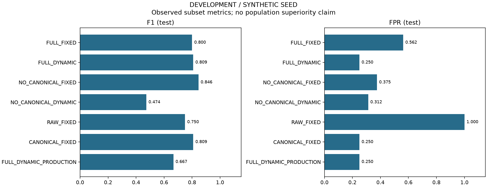

# Fair evaluation run

Claim level: **DEVELOPMENT / SYNTHETIC SEED**

Dataset: coderisk-research-v4-seed-1.0; eligible same-language pairs: 75.
This run checks the evaluation pipeline. Previously inspected seed data cannot establish generalization.

## Test metrics

| Method | N | TP | FP | TN | FN | F1 | FPR |
|---|---:|---:|---:|---:|---:|---:|---:|
| FULL_FIXED | 40 | 22 | 9 | 7 | 2 | 0.8000 | 0.5625 |
| FULL_DYNAMIC | 40 | 19 | 4 | 12 | 5 | 0.8085 | 0.2500 |
| NO_CANONICAL_FIXED | 40 | 22 | 6 | 10 | 2 | 0.8462 | 0.3750 |
| NO_CANONICAL_DYNAMIC | 40 | 9 | 5 | 11 | 15 | 0.4737 | 0.3125 |
| RAW_FIXED | 40 | 24 | 16 | 0 | 0 | 0.7500 | 1.0000 |
| CANONICAL_FIXED | 40 | 19 | 4 | 12 | 5 | 0.8085 | 0.2500 |
| FULL_DYNAMIC_PRODUCTION | 40 | 14 | 4 | 12 | 10 | 0.6667 | 0.2500 |

Selection uses validation F1, lower FPR tie-break, then the documented parameter tie-break.
Ablation removes canonical-token and identifier-mapping signals; remaining weights are .50 raw + .50 AST. All degraded paths retain raw-token fallback.
Cluster percentile intervals condition on selected parameters; they do not include tuning uncertainty. Few independent groups and synthetic data sharply limit interpretation.
Blank CSV metric cells mean undefined denominators. Missing JPlag comparisons are excluded and listed, never imputed as zero.
JPlag matched coverage: 72/75; comparable: True.
JPlag comparison reselects all thresholds on its common validation subset; inspect jplag/metrics.csv separately from picas/metrics.csv.
Template removal and JPlag normalization are disabled in this protocol; min-tokens is fixed in the configuration, not optimized here.

